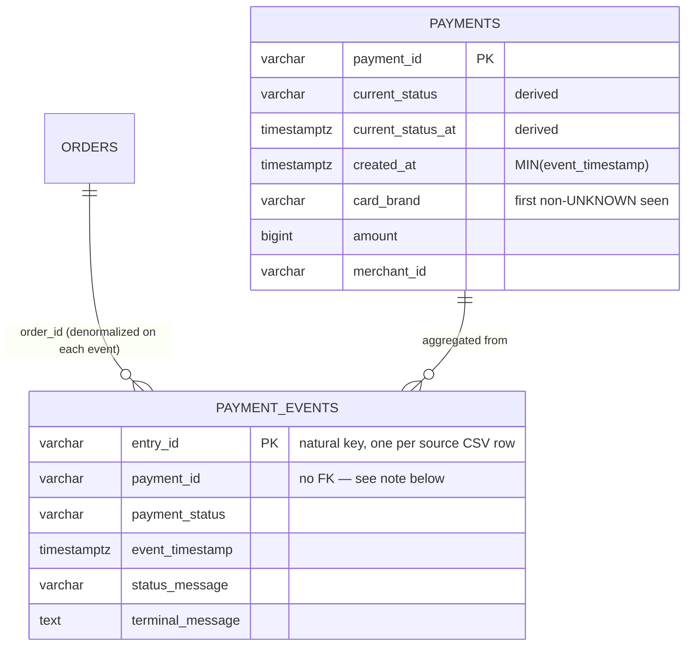

# PIP — Payment Domain Model Architecture

Covers the PostgreSQL-backed operational data model (`pip_db`) introduced from
Sprint 2A onward, focused on the Payment Domain Model locked in Sprint
9C.2/9C.2A and implemented in Sprint 9C.3. Firestore remains the system of
record for the pre-existing incidents/investigations app; this document is
scoped to the Postgres side only.

## Orders → Payments → Payment Events

Prior to Sprint 9C.3, `payments` held one row per source CSV row — a single
logical payment with several gateway callbacks over its lifetime produced
several rows sharing a `payment_id`, which collided against `payment_id` as a
primary key. That was the root cause of the Sprint 9C migration slowdown.

The fix splits payment data into two tables:

- **`payments`** — one row per logical payment. A **pure derived aggregate**:
  every column except `payment_id` is computed from that payment's full
  `payment_events` history. Nothing ever writes to it from a CSV row
  directly.
- **`payment_events`** — append-only lifecycle log, one row per source CSV
  row / gateway callback, mirroring the full original row shape. This is the
  only table ETL writes to directly. `entry_id` (already unique per row in
  the source data) is its natural primary key — no invented surrogate key.

**Deliberate design choice:** `payment_events.payment_id` has **no foreign
key** to `payments.payment_id`. Since `payments` is derived *from*
`payment_events`, requiring the payments row to exist first would make
first-time ingestion of a brand-new payment impossible — the aggregation
step (below) always runs after the events land, not before.

## The Current Status Derivation Rule

This is the one rule every consumer of "what is this payment's status right
now" must agree on. It is implemented **once**, in
`backend/src/paymentEvents/paymentEventModel.js`, and every other layer reads
the already-derived `payments.current_status` rather than recomputing it:

1. Collect all `payment_events` rows for a `payment_id`.
2. `ORDER BY event_timestamp DESC, entry_id DESC`.
3. The first row after sorting is authoritative — its `payment_status` and
   `event_timestamp` become `payments.current_status` / `current_status_at`.

This is a **"find the latest"** sort, not the Timeline's narrative sort. The
Timeline (`correlation/timelineBuilder.js`) sorts the same events **ASCENDING
by timestamp** to tell the chronological story of what happened — the two
sorts serve different purposes and must never share a comparator.

### Other aggregate fields

Everything else on `payments` besides `current_status`/`current_status_at`
is derived from the same event history:

| Field | Rule |
|---|---|
| `created_at` | `MIN(event_timestamp)` — true business origination time |
| `card_brand` | First non-empty / non-`UNKNOWN` value seen, scanning chronologically ascending (confirmed **not** "latest wins" — Sprint 9C.2A) |
| Everything else (`amount`, `merchant_id`, `order_id`, `transaction_id`, `voided`, etc.) | Copied from the "current" event — the same row the Current Status Derivation Rule selects — since these fields are confirmed stable across a payment's lifecycle |

See `deriveAggregate()` in `paymentEventModel.js` for the reference
implementation, and the comment block above `CREATE TABLE payments` in
`backend/src/config/postgres/schema.sql` for the schema-level version of this
same rule.

## ETL — two-stage import

`backend/src/import/importManager.js` (the shared CSV → Postgres framework)
is never modified — it only knows how to insert one CSV row into one table.
The payment_events dataset is imported in two stages
(`backend/src/import/importPaymentEventsFile.js`):

- **Stage A** — `importFile({ datasetType: 'payment_events', ... })`, a
  perfectly ordinary batch insert via `paymentEventTransformer.js` /
  `paymentEventValidator.js`. No PK-conflict risk (unlike the old
  `payment_id`-keyed `payments` import), since `entry_id` is unique per row.
- **Stage B** — `paymentEventsService.recomputeAggregatesForImportJob()`:
  for every `payment_id` touched by that import job, recompute its
  `payments` aggregate row from its **full** event history, queried fresh
  from the DB — never scoped to only this file's events, since a payment's
  events can span two different source CSV files near a date-range boundary
  (flagged Sprint 9C.2A).

Sprint 9C.3 built this framework only — it has not been run against any
production CSV. The 34,746-row partial `payments` table from the earlier,
intentionally-stopped Sprint 9C migration was backed up to
`payments_backup_sprint9c3` before the schema evolution and is re-derivable
from source CSVs (still untouched on disk) via a future sprint's real run.

## Downstream consumers

None of these recompute the Current Status Derivation Rule — they read
`payments.current_status` (already derived) and, where richer history is
useful, the `paymentEvents` array attached by the Correlation Engine.

- **Correlation Engine** (`correlation/correlationEngine.js`) — every
  `correlateBy*` function now attaches `result.paymentEvents`, fetched via
  `relationshipResolver.getPaymentEventsByPaymentIds()`.
- **Timeline** (`correlation/timelineBuilder.js`) — one real timeline entry
  per `payment_events` row (status, timestamp, `status_message`/
  `terminal_message`), instead of the old 2–3-entry approximation
  synthesized from a single `payments` row. `payments.void_requested_at`
  (still an aggregate-only field) contributes its own separate entry.
- **Incident Detection** (`incidents/rules/paymentFailureRule.js`) — filters
  on `payment.current_status` instead of the removed `payment.payment_status`,
  and enriches evidence with the failed payment's own `payment_events` for
  richer downstream investigation.
- **AI Investigation** (`investigation/templates.js`) — the `PAYMENT_FAILURE`
  mock template pulls a `status_message`/`terminal_message` straight off the
  failure event's evidence when present, instead of always assuming an
  unknown decline reason.
- **REST API** — every controller (`api/controllers/*.js`) is a pure
  passthrough of the Correlation/Incident/Investigation Engine result; no
  route-level code changes were needed. `payment.current_status` and
  `paymentEvents` are exposed automatically.

## Known breaking change

`payment.payment_status` no longer exists on a correlation/incident/API
response — it's `payment.current_status` now. This is the intended effect of
the sprint (the whole point is that "payment status" is no longer a single
column on a single row) and is not backwards-compatible; no shim was added,
since one would reintroduce the exact ambiguity this sprint removes.

## Known risk (not solved in this sprint — scope was schema evolution only)

`payments.purchase_payment_id` / `reference_payment_id` are self-referencing
FKs (refund/void chains). Stage B recomputes aggregates per touched
`payment_id` without guaranteeing processing order; if a single import job's
distinct payment IDs contain both a refund and the purchase it references,
and the purchase hasn't been aggregated into `payments` yet, the refund's
upsert can hit an FK violation. The original system already required
chronological file processing for this same reason when `payments` wrote
these columns directly — the same operational discipline still applies. A
dependency-ordered aggregation pass would remove the constraint but is
scope creep beyond this sprint's "schema evolution only" mandate.
